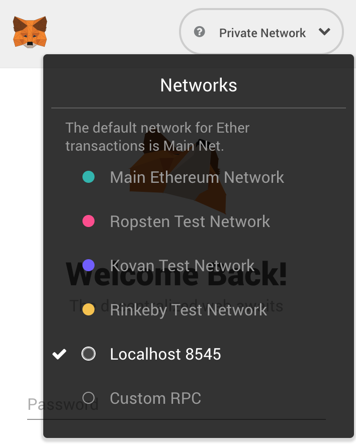
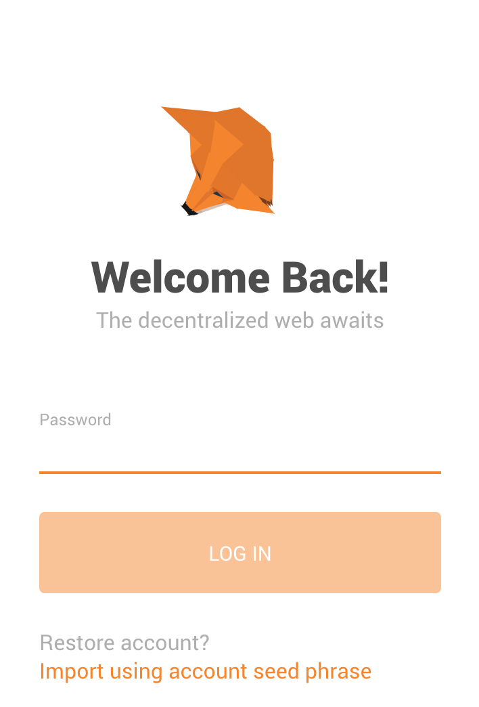

# Archwing

An Ethereum distributed app that manages insurance for travelers.

## Requirements

| Software       | Description                                                                                                               |
| -------------- | ------------------------------------------------------------------------------------------------------------------------- |
| Node v11       | We recommend [node version manager](https://github.com/creationix/nvm) to change version                                  |
| NPM v6         | Used to install other necessary modules                                                                                   |
| Python v2.7.14 | Used in `npm install`, we recommend using [pyenv](https://github.com/pyenv/pyenv) to install                              |
| Metamask       | Ethereum wallet, we recommend the Chrome plugin [here](https://metamask.io/)                                              |
| Ganache        | Private blockchain, use `npm install -g ganache-cli` for CLI, or [use this](https://truffleframework.com/ganache) for GUI |
| Truffle        | Ethereum development suite, use `npm install -g truffle` to install                                                       |

## Setup

If you are using node version manager,

```sh
nvm install 11
nvm use 11
```

If you are using pyenv,

```sh
pyenv install -v 2.7.14
```

After all that, install the necessary modules and copy the API key.
Ethereum-Bridge is needed for the Oraclize engine to access our private network.

```sh
npm install
npm install -g ethereum-bridge
cp .env.sample .env  # fill in the configuration required.
```

## Usage

First, start up Ganache as well as Ethereum-Bridge.

```sh
ganache-cli  # or start up Ganache GUI
ethereum-bridge --dev -H <host:port> -a 1
```

Finally, use Truffle to compile the contracts and start up the dApp.

```sh
truffle compile
truffle migrate
npm run start
```

After starting up the dApp:

1. Head to localhost:3000 and logout from any existing Metamask account

2. Switch network to private network eg. localhost:8545 (Ganache CLI default) or localhost:7545 (Ganache GUI default)
   <br>

3. Restore account in Metamask with Ganache's mnemonic
   via "Import using account seed phrase"
   <br>

4. Login to Metamask using the above restored account

5. Approve the connection

## Testing

```sh
truffle test  # for contract testing
npm run test  # for React testing
```

## Building

```sh
npm run build
```
